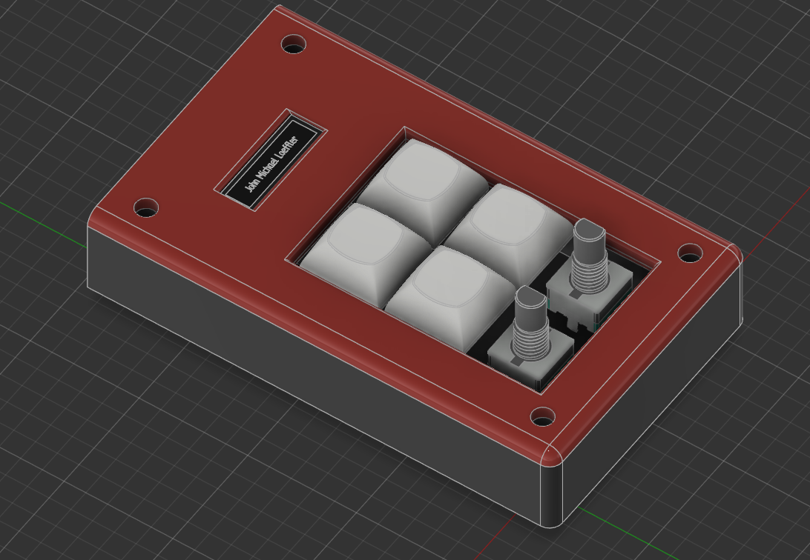
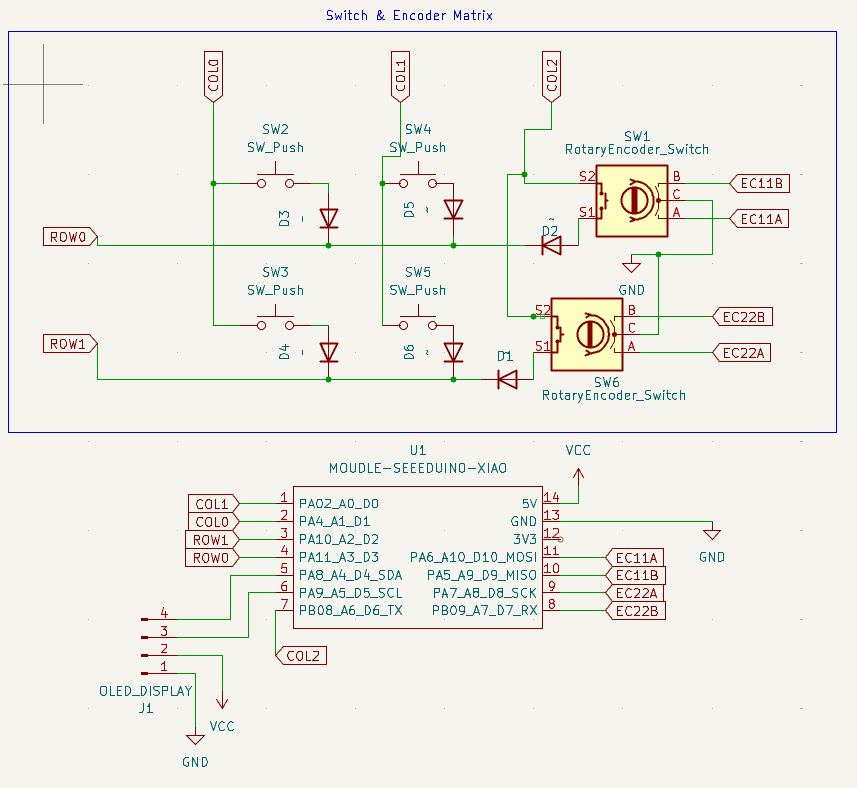
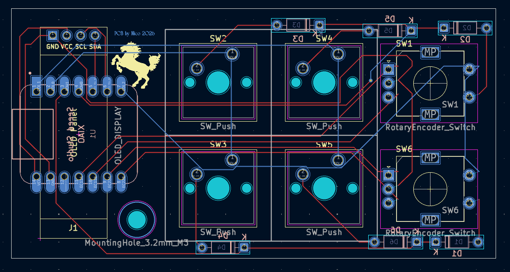
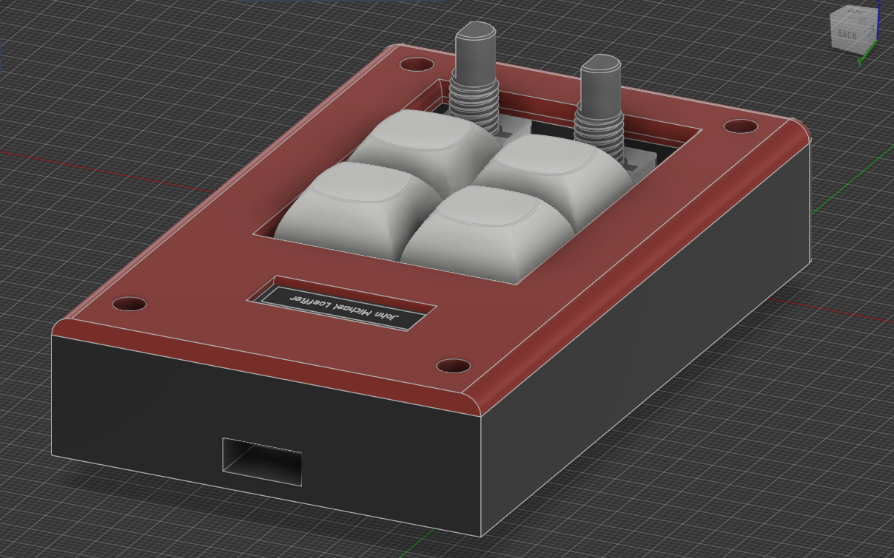
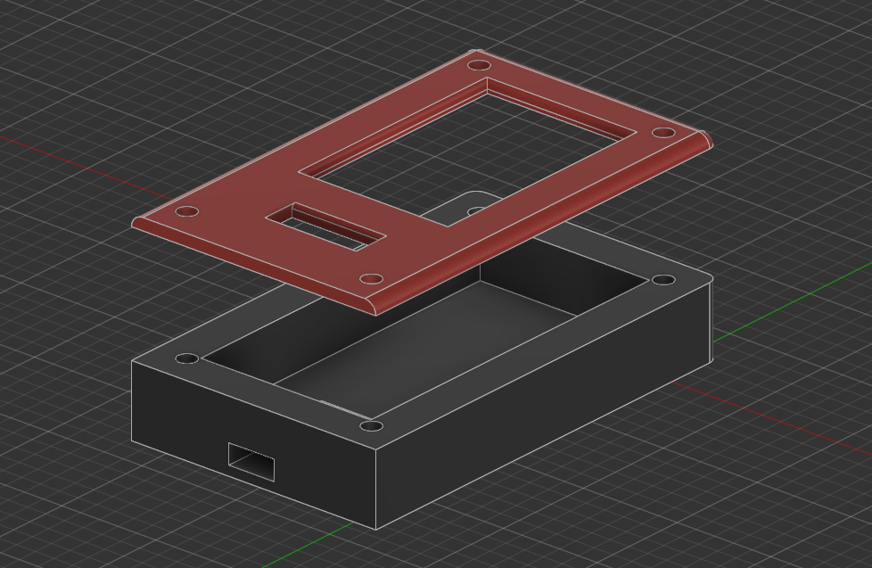

# Micro-Macro-Pad!

A small design with 4 Switches and 2 Rotary Encoders for maximum freedom with hotkeys. It's the first hardware I designed, and the first time I worked with both KiCad and Autodesk Fusion, but which was easy and fun to get started thanks to the resources on https://blueprint.hackclub.com/hackpad

## Features
- runs on KMK
- added a little animation that flashes the OLED in a wave pattern on every keystroke

## BOM
- 1 Seeed XIAO RP2040
- 4 MX-Style Switches
- 4 blank DSA keycaps
- 2 EC11 Rotary encoders
- 1 0.91 inch OLED display
- 5 M3x16mm screws
- 5 M3x5mmx4mm heatset inserts
- 6 1N4148 Diodes

## Images of the pad

